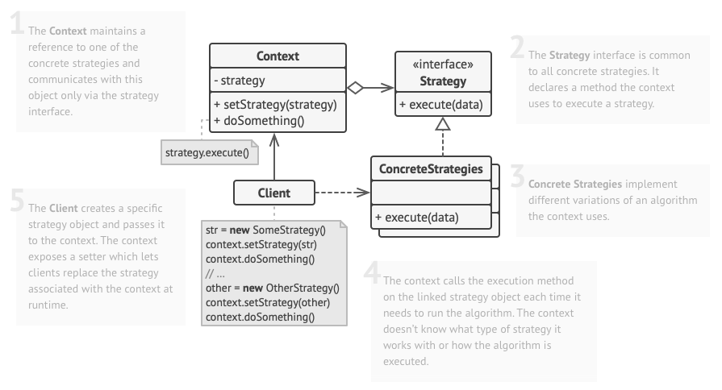
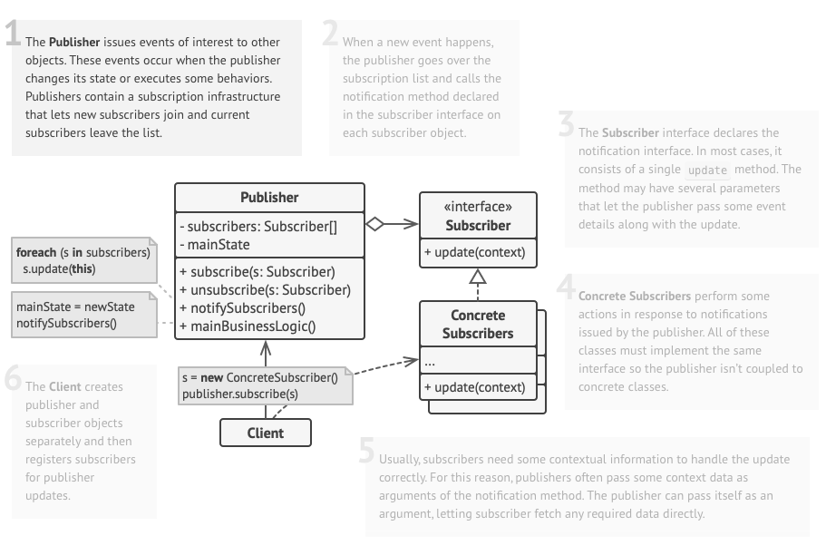

# Behavioral Design Patterns

## Table of Contents

1. [Chain of Responsibility](#chain-of-responsibility)
1. [Command](#command)
1. [Strategy](#strategy)
1. [Observer](#observer)
1. [*Mediator](#mediator)
1. [*Iterator](#iterator)
1. [*State](#state)
1. [*Memento](#memento)
1. [*Visitor](#visitor)
1. [*Template](#template)

## Chain of Responsibility

Chain of Responsibility is a behavioral design pattern that lets you pass requests along a chain of handlers. Upon receiving a request, each handler decides either to process the request or to pass it to the next handler in the chain.

It’s crucial that all handler classes implement the same interface. Each concrete handler should only care about the following one having the execute method. This way you can compose chains at runtime, using various handlers without coupling your code to their concrete classes.

### When to use

Usage examples: The Chain of Responsibility is pretty common in Python. It’s mostly relevant when your code operates with chains of objects, such as filters, event chains, etc.

Identification: The pattern is recognizable by behavioral methods of one group of objects that indirectly call the same methods in other objects, while all the objects follow the common interface.

- Use the Chain of Responsibility pattern when your program is expected to process different kinds of requests in various ways, but the exact types of requests and their sequences are unknown beforehand.
    - The pattern lets you link several handlers into one chain and, upon receiving a request, “ask” each handler whether it can process it. This way all handlers get a chance to process the request.
- Use the pattern when it’s essential to execute several handlers in a particular order.
    - Since you can link the handlers in the chain in any order, all requests will get through the chain exactly as you planned.
- Use the CoR pattern when the set of handlers and their order are supposed to change at runtime.
    - If you provide setters for a reference field inside the handler classes, you’ll be able to insert, remove or reorder handlers dynamically.
- Request Processing: In situations where requests must pass through multiple processing stages, each handling a specific task. If one stage fails, the request is forwarded to the next, ensuring efficient processing.
- Logging: Logging systems with multiple log handlers like console, file, and email loggers. Handlers decide whether to handle a log message based on severity. If a handler can’t, it gracefully passes it to the next in the chain.
- User Interface Events: For user interface components, such as buttons, that handle events through a chain of listeners. Each listener can decide whether to consume or propagate the event, offering flexibility in complex interfaces.
- Middleware in web frameworks

### [Sample Implementation](./chain_of_responsibility.py)

### Key Concepts

- Handler (Abstract Class or Interface): The Handler is an abstract class or interface defining the common interface for concrete handlers. It typically includes the handle_request method, specifying how requests are processed. Concrete handlers must extend or implement this.
- Concrete Handlers: Concrete Handlers are classes extending the Handler. They represent processing stages in the chain, responsible for handling specific requests. Each concrete handler processes a request or passes it to the next.
- Client: The Client initiates requests and sends them to the first handler in the chain. It remains unaware of specific handlers and their responsibilities. The client creates and configures the chain.
- Chain: The Chain class manages the sequence of handlers, maintaining them in an ordered list or other data structures. Its role is to pass requests from one handler to the next until successful processing or reaching the end of the chain.

### Types of CoRs

- Basic Chain: In this standard form, handlers are linked sequentially, and each handler either processes the request or passes it to the next in line.
- Bidirectional Chain: Handlers can traverse the chain in both forward and backward directions, allowing for more complex decision-making scenarios.
- Hierarchical Chain: Handlers are organized into a hierarchical structure, where certain handlers have sub-handlers. Requests can be passed down the hierarchy or propagated back up if necessary.
- Dynamic Chain: The chain’s composition can change dynamically during runtime, enabling on-the-fly adjustments to handle different types of requests.

### Pros and Cons

| Pros | Cons |
| ---- | ---- |
| You can control the order of request handling | Some requests may end up unhandled |
| Single responsibility principle is upheld: You can decouple classes that invoke operations from classes that perform operations | Careful design is needed to ensure that all requests are handled appropriately. |
| Open/cosed principle: You can introduce new handlers into the app without breaking existing code | Performance Overhead: Passing requests through a chain of handlers can introduce a slight performance overhead due to the dynamic nature of the pattern. |

### Relationships with other patterns

- Chain of Responsibility, Command, Mediator and Observer address various ways of connecting senders and receivers of requests:
    - Chain of Responsibility passes a request sequentially along a dynamic chain of potential receivers until one of them handles it.
    - Command establishes unidirectional connections between senders and receivers.
    - Mediator eliminates direct connections between senders and receivers, forcing them to communicate indirectly via a mediator object.
    - Observer lets receivers dynamically subscribe to and unsubscribe from receiving requests.
- Chain of Responsibility is often used in conjunction with Composite. In this case, when a leaf component gets a request, it may pass it through the chain of all of the parent components down to the root of the object tree.
- Handlers in Chain of Responsibility can be implemented as Commands. In this case, you can execute a lot of different operations over the same context object, represented by a request.
    - However, there’s another approach, where the request itself is a Command object. In this case, you can execute the same operation in a series of different contexts linked into a chain.
- Chain of Responsibility and Decorator have very similar class structures. Both patterns rely on recursive composition to pass the execution through a series of objects. However, there are several crucial differences.
    - The CoR handlers can execute arbitrary operations independently of each other. They can also stop passing the request further at any point. On the other hand, various Decorators can extend the object’s behavior while keeping it consistent with the base interface. In addition, decorators aren’t allowed to break the flow of the request.

## Command

The Command design pattern is a behavioral pattern that encapsulates a request as an object, thereby allowing for parameterization of clients with different requests, queuing of requests, and logging of requests.

It separates the sender of a request from the receiver, providing a means for decoupling invokers and receivers.

### When to use

- Complex Interfaces: Ideal for applications with intricate user interfaces, simplifying action management, including undo/redo, toolbar customization, and shortcuts.
- Queueing Tasks: Useful for queuing and scheduling tasks or commands, facilitating orderly execution, vital for automation and task management.
    -  As with any other object, a command can be serialized, which means converting it to a string that can be easily written to a file or a database. Later, the string can be restored as the initial command object. Thus, you can delay and schedule command execution. But there’s even more! In the same way, you can queue, log or send commands over the network.
- Undo/Redo Needs: Valuable in applications requiring strong undo and redo capabilities, like design software or text editors, improving user productivity.
    -  Although there are many ways to implement undo/redo, the Command pattern is perhaps the most popular of all.
    - To be able to revert operations, you need to implement the history of performed operations. The command history is a stack that contains all executed command objects along with related backups of the application’s state.
    - This method has two drawbacks. First, it isn’t that easy to save an application’s state because some of it can be private. This problem can be mitigated with the Memento pattern.
    - Second, the state backups may consume quite a lot of RAM. Therefore, sometimes you can resort to an alternative implementation: instead of restoring the past state, the command performs the inverse operation. The reverse operation also has a price: it may turn out to be hard or even impossible to implement.
- Use the Command pattern when you want to parametrize objects with operations.
    - The Command pattern can turn a specific method call into a stand-alone object. This change opens up a lot of interesting uses: you can pass commands as method arguments, store them inside other objects, switch linked commands at runtime, etc.
        - Here’s an example: you’re developing a GUI component such as a context menu, and you want your users to be able to configure menu items that trigger operations when an end user clicks an item.
-

### [Sample Implementation](./command.py)

### Key Components

- Command: This is an interface or an abstract class that declares an execute method. Concrete command classes implement this method, encapsulating the action to be performed.
- Concrete Command: These are the concrete implementations of the Command interface. They hold a reference to a receiver object and invoke specific actions on it.
- Receiver: The Receiver is the object that actually performs the action associated with the command.
- Invoker: The Invoker is responsible for storing and executing commands. It doesn’t need to know the specifics of how the command is executed.

By structuring your code this way, you achieve a high degree of decoupling. The sender (Invoker) doesn’t need to know anything about the receiver or how the command is handled.

### Pros and Cons

| Pros | Cons |
| ---- | ---- |
| Decoupling: The pattern decouples the sender and receiver of a request, providing flexibility in managing commands and actions. | Complexity: Implementing the pattern can increase code complexity. |
| Multi-Level Undo/Redo: The Command Pattern is ideal for implementing multi-level undo/redo functionality, as each command can be stored and reversed. | Overhead: It may introduce a minor memory and performance overhead. |
| Extensibility: New commands can be added without altering existing code, making the system more extensible. | Applicability: Assess if the pattern suits your specific needs, as its benefits are most pronounced in scenarios requiring command decoupling and undo/redo functionality. |

### Relationships to other patterns

- Command and Chain of Responsibility patterns are both about managing requests and actions, but they do so differently.
    - Command Pattern: Encapsulates a request as an object, decoupling the sender and receiver. It’s ideal for implementing multi-level undo/redo functionality and handling actions.
    - Chain of Responsibility Pattern: Passes a request through a chain of handlers. It’s used when you want to give more than one object a chance to handle a request without specifying the receiver explicitly. Unlike the Command Pattern, it doesn’t encapsulate a command but focuses on finding the right handler.
- Command and Mediator patterns deal with connections between senders and receivers, yet they have distinct communication approaches.
    - Command Pattern: Focuses on encapsulating and decoupling commands, allowing for undo/redo functionality. It doesn’t necessarily involve communication between multiple objects.
    - Mediator Pattern: Defines an object that encapsulates how a set of objects interact. It promotes loose coupling by centralizing communication between objects. While it can be used in conjunction with the Command Pattern, its primary purpose is different.
- Command and Observer patterns address how receivers subscribe and receive requests, but their primary roles vary.
    - Command Pattern: Encapsulates commands and decouples senders from receivers. It’s suitable for scenarios where actions need to be executed without sender-receiver dependencies.
    - Observer Pattern: Defines a one-to-many dependency between objects. When one object (the subject) changes state, all its dependents (observers) are notified and updated automatically. While both patterns support decoupling, the Observer Pattern is more about keeping objects in sync with a changing subject.

## Strategy

Strategy is a behavioral design pattern that lets you define a family of algorithms, put each of them into a separate class, and make their objects interchangeable.

The Strategy pattern suggests that you take a class that does something specific in a lot of different ways and extract all of these algorithms into separate classes called strategies.

The original class, called context, must have a field for storing a reference to one of the strategies. The context delegates the work to a linked strategy object instead of executing it on its own.

The context isn’t responsible for selecting an appropriate algorithm for the job. Instead, the client passes the desired strategy to the context. In fact, the context doesn’t know much about strategies. It works with all strategies through the same generic interface, which only exposes a single method for triggering the algorithm encapsulated within the selected strategy.

This way the context becomes independent of concrete strategies, so you can add new algorithms or modify existing ones without changing the code of the context or other strategies.

### When to use

- Use the Strategy pattern when you want to use different variants of an algorithm within an object and be able to switch from one algorithm to another during runtime.
    - The Strategy pattern lets you indirectly alter the object’s behavior at runtime by associating it with different sub-objects which can perform specific sub-tasks in different ways.
-  Use the Strategy when you have a lot of similar classes that only differ in the way they execute some behavior.
    - The Strategy pattern lets you extract the varying behavior into a separate class hierarchy and combine the original classes into one, thereby reducing duplicate code.
- Use the pattern to isolate the business logic of a class from the implementation details of algorithms that may not be as important in the context of that logic.
    - The Strategy pattern lets you isolate the code, internal data, and dependencies of various algorithms from the rest of the code. Various clients get a simple interface to execute the algorithms and switch them at runtime.
- Use the pattern when your class has a massive conditional statement that switches between different variants of the same algorithm.
    - The Strategy pattern lets you do away with such a conditional by extracting all algorithms into separate classes, all of which implement the same interface. The original object delegates execution to one of these objects, instead of implementing all variants of the algorithm.

### [Sample Implementation](./strategy.py)

### Key Components

### Pros and Cons

| Pros | Cons |
| ---- | ---- |
|  You can swap algorithms used inside an object at runtime. |  If you only have a couple of algorithms and they rarely change, there’s no real reason to overcomplicate the program with new classes and interfaces that come along with the pattern. |
|  You can isolate the implementation details of an algorithm from the code that uses it. | Clients must be aware of the differences between strategies to be able to select a proper one. |
|  You can replace inheritance with composition. | |
| Open/Closed Principle. You can introduce new strategies without having to change the context. | |

### Relationships to other patterns

- Bridge, State, Strategy (and to some degree Adapter) have very similar structures. Indeed, all of these patterns are based on composition, which is delegating work to other objects. However, they all solve different problems. A pattern isn’t just a recipe for structuring your code in a specific way. It can also communicate to other developers the problem the pattern solves.
- Command and Strategy may look similar because you can use both to parameterize an object with some action. However, they have very different intents.
    - You can use Command to convert any operation into an object. The operation’s parameters become fields of that object. The conversion lets you defer execution of the operation, queue it, store the history of commands, send commands to remote services, etc.
    - On the other hand, Strategy usually describes different ways of doing the same thing, letting you swap these algorithms within a single context class.
- Decorator lets you change the skin of an object, while Strategy lets you change the guts.
- Template Method is based on inheritance: it lets you alter parts of an algorithm by extending those parts in subclasses. Strategy is based on composition: you can alter parts of the object’s behavior by supplying it with different strategies that correspond to that behavior. Template Method works at the class level, so it’s static. Strategy works on the object level, letting you switch behaviors at runtime.
- State can be considered as an extension of Strategy. Both patterns are based on composition: they change the behavior of the context by delegating some work to helper objects. Strategy makes these objects completely independent and unaware of each other. However, State doesn’t restrict dependencies between concrete states, letting them alter the state of the context at will.

## Observer

Observer is a behavioral design pattern that lets you define a subscription mechanism to notify multiple objects about any events that happen to the object they’re observing.

The object that has some interesting state is often called subject, but since it’s also going to notify other objects about the changes to its state, we’ll call it publisher. All other objects that want to track changes to the publisher’s state are called subscribers.

The Observer pattern suggests that you add a subscription mechanism to the publisher class so individual objects can subscribe to or unsubscribe from a stream of events coming from that publisher. Fear not! Everything isn’t as complicated as it sounds. In reality, this mechanism consists of 1) an array field for storing a list of references to subscriber objects and 2) several public methods which allow adding subscribers to and removing them from that list.

### When to use

-  Use the pattern when some objects in your app must observe others, but only for a limited time or in specific cases.
    - The subscription list is dynamic, so subscribers can join or leave the list whenever they need to.
- Use the Observer pattern when changes to the state of one object may require changing other objects, and the actual set of objects is unknown beforehand or changes dynamically.
    - You can often experience this problem when working with classes of the graphical user interface. For example, you created custom button classes, and you want to let the clients hook some custom code to your buttons so that it fires whenever a user presses a button.
    - The Observer pattern lets any object that implements the subscriber interface subscribe for event notifications in publisher objects. You can add the subscription mechanism to your buttons, letting the clients hook up their custom code via custom subscriber classes.

Examples:

- Stock market updates: In a trading application, multiple traders may be interested in receiving updates about the prices of different stocks. The Subject in this case would be the stock market, and the Observers would be the traders. When the price of a stock changes, the stock market would notify all the traders who are observing it.
- Temperature monitoring system: In a temperature monitoring system, there may be multiple devices that need to know when the temperature changes. The Subject in this case would be the temperature sensor, and the Observers would be the devices that need to know about the temperature changes. When the temperature changes, the sensor would notify all the devices that are observing it.
- Event-driven systems: In an event-driven system, there may be multiple components that need to react to different events. The Subject in this case would be the event dispatcher, and the Observers would be the components that need to react to the events. When an event occurs, the dispatcher would notify all the components that are observing it.
- Chat application: In a chat application, multiple users may be interested in receiving updates about new messages. The Subject in this case would be the chat room, and the Observers would be the users. When a new message is sent, the chat room would notify all the users who are observing it.

### [Sample Implementation](./observer.py)

### Key Components

### Pros and Cons

| Pros | Cons |
| ---- | ---- |
|  Open/Closed Principle. You can introduce new subscriber classes without having to change the publisher’s code (and vice versa if there’s a publisher interface). | Subscribers are notified in random order. |
| You can establish relations between objects at runtime. | |

### Relationships to other patterns

- Chain of Responsibility, Command, Mediator and Observer address various ways of connecting senders and receivers of requests:
    - Chain of Responsibility passes a request sequentially along a dynamic chain of potential receivers until one of them handles it.
    - Command establishes unidirectional connections between senders and receivers.
    - Mediator eliminates direct connections between senders and receivers, forcing them to communicate indirectly via a mediator object.
    - Observer lets receivers dynamically subscribe to and unsubscribe from receiving requests.