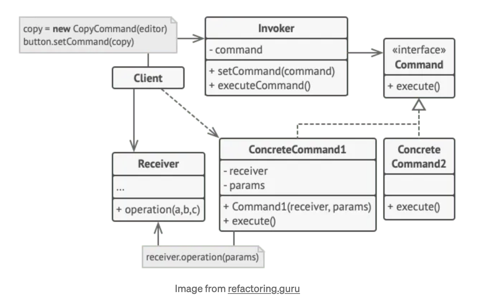

# Behavioral Design Patterns

## Table of Contents

1. [Chain of Responsibility](#chain-of-responsibility)

## Chain of Responsibility

Chain of Responsibility is a behavioral design pattern that lets you pass requests along a chain of handlers. Upon receiving a request, each handler decides either to process the request or to pass it to the next handler in the chain.

It’s crucial that all handler classes implement the same interface. Each concrete handler should only care about the following one having the execute method. This way you can compose chains at runtime, using various handlers without coupling your code to their concrete classes.

### When to use

Usage examples: The Chain of Responsibility is pretty common in Python. It’s mostly relevant when your code operates with chains of objects, such as filters, event chains, etc.

Identification: The pattern is recognizable by behavioral methods of one group of objects that indirectly call the same methods in other objects, while all the objects follow the common interface.

- Use the Chain of Responsibility pattern when your program is expected to process different kinds of requests in various ways, but the exact types of requests and their sequences are unknown beforehand.
    - The pattern lets you link several handlers into one chain and, upon receiving a request, “ask” each handler whether it can process it. This way all handlers get a chance to process the request.
- Use the pattern when it’s essential to execute several handlers in a particular order.
    - Since you can link the handlers in the chain in any order, all requests will get through the chain exactly as you planned.
- Use the CoR pattern when the set of handlers and their order are supposed to change at runtime.
    - If you provide setters for a reference field inside the handler classes, you’ll be able to insert, remove or reorder handlers dynamically.
- Request Processing: In situations where requests must pass through multiple processing stages, each handling a specific task. If one stage fails, the request is forwarded to the next, ensuring efficient processing.
- Logging: Logging systems with multiple log handlers like console, file, and email loggers. Handlers decide whether to handle a log message based on severity. If a handler can’t, it gracefully passes it to the next in the chain.
- User Interface Events: For user interface components, such as buttons, that handle events through a chain of listeners. Each listener can decide whether to consume or propagate the event, offering flexibility in complex interfaces.
- Middleware in web frameworks

### [Sample Implementation](./chain_of_responsibility.py)

### Key Concepts

- Handler (Abstract Class or Interface): The Handler is an abstract class or interface defining the common interface for concrete handlers. It typically includes the handle_request method, specifying how requests are processed. Concrete handlers must extend or implement this.
- Concrete Handlers: Concrete Handlers are classes extending the Handler. They represent processing stages in the chain, responsible for handling specific requests. Each concrete handler processes a request or passes it to the next.
- Client: The Client initiates requests and sends them to the first handler in the chain. It remains unaware of specific handlers and their responsibilities. The client creates and configures the chain.
- Chain: The Chain class manages the sequence of handlers, maintaining them in an ordered list or other data structures. Its role is to pass requests from one handler to the next until successful processing or reaching the end of the chain.

### Types of CoRs

- Basic Chain: In this standard form, handlers are linked sequentially, and each handler either processes the request or passes it to the next in line.
- Bidirectional Chain: Handlers can traverse the chain in both forward and backward directions, allowing for more complex decision-making scenarios.
- Hierarchical Chain: Handlers are organized into a hierarchical structure, where certain handlers have sub-handlers. Requests can be passed down the hierarchy or propagated back up if necessary.
- Dynamic Chain: The chain’s composition can change dynamically during runtime, enabling on-the-fly adjustments to handle different types of requests.

### Pros and Cons

| Pros | Cons |
| ---- | ---- |
| You can control the order of request handling | Some requests may end up unhandled |
| Single responsibility principle is upheld: You can decouple classes that invoke operations from classes that perform operations | Careful design is needed to ensure that all requests are handled appropriately. |
| Open/cosed principle: You can introduce new handlers into the app without breaking existing code | Performance Overhead: Passing requests through a chain of handlers can introduce a slight performance overhead due to the dynamic nature of the pattern. |

### Relationships with other patterns

- Chain of Responsibility, Command, Mediator and Observer address various ways of connecting senders and receivers of requests:
    - Chain of Responsibility passes a request sequentially along a dynamic chain of potential receivers until one of them handles it.
    - Command establishes unidirectional connections between senders and receivers.
    - Mediator eliminates direct connections between senders and receivers, forcing them to communicate indirectly via a mediator object.
    - Observer lets receivers dynamically subscribe to and unsubscribe from receiving requests.
- Chain of Responsibility is often used in conjunction with Composite. In this case, when a leaf component gets a request, it may pass it through the chain of all of the parent components down to the root of the object tree.
- Handlers in Chain of Responsibility can be implemented as Commands. In this case, you can execute a lot of different operations over the same context object, represented by a request.
    - However, there’s another approach, where the request itself is a Command object. In this case, you can execute the same operation in a series of different contexts linked into a chain.
- Chain of Responsibility and Decorator have very similar class structures. Both patterns rely on recursive composition to pass the execution through a series of objects. However, there are several crucial differences.
    - The CoR handlers can execute arbitrary operations independently of each other. They can also stop passing the request further at any point. On the other hand, various Decorators can extend the object’s behavior while keeping it consistent with the base interface. In addition, decorators aren’t allowed to break the flow of the request.

## Command

### When to use

### [Sample Implementation](./command.py)

### Key Concepts

### Pros and Cons