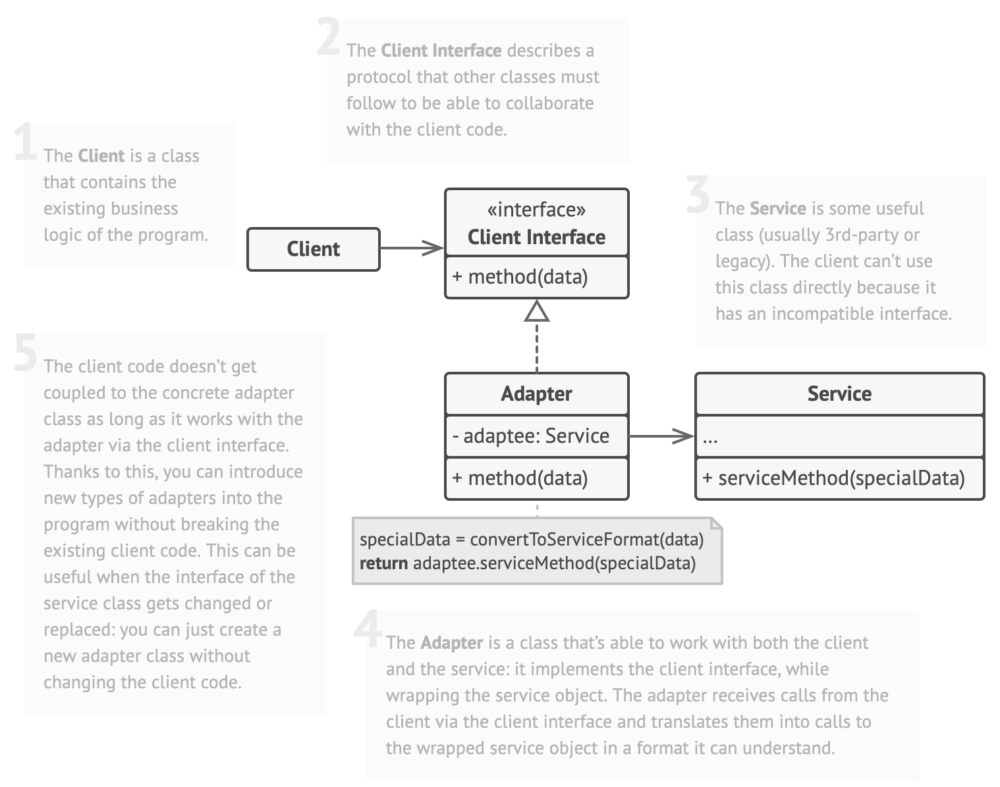
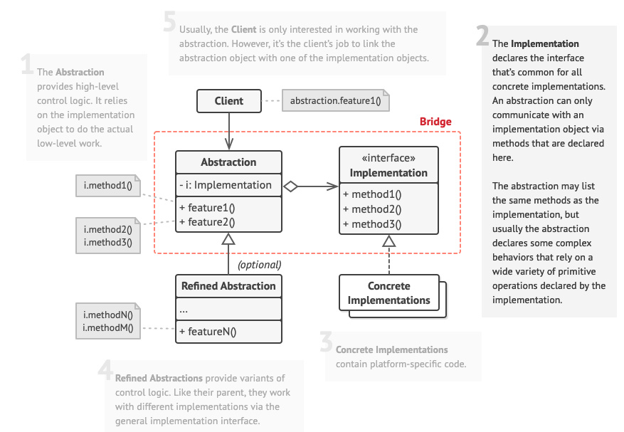
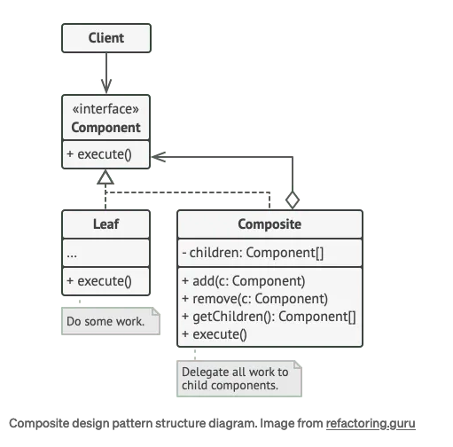
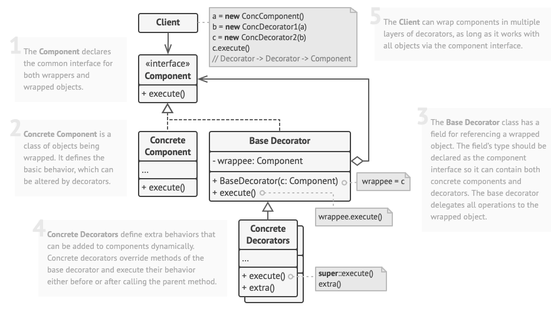
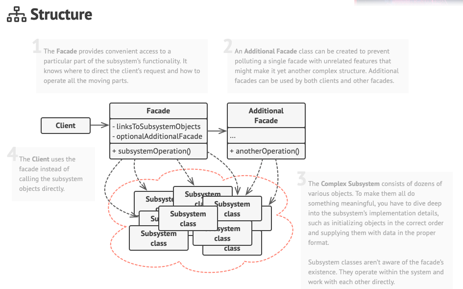

# Structural Design Patterns

## Adapter

The Adapter pattern is a structural design pattern that facilitates the interaction between two interfaces that are incompatible or cannot work together directly. It acts as a bridge, allowing objects with different interfaces to collaborate.

The primary goal of the Adapter pattern is to ensure that client code can work with classes it was not initially designed to support. It achieves this without altering the source code of either the client or the adaptee (the class with the incompatible interface).

- An adapter is a special object that converts the interface of one object so that another object can understand it.
- An adapter wraps one of the objects to hide the complexity of conversion happening behind the scenes. The wrapped object isn’t even aware of the adapter. For example, you can wrap an object that operates in meters and kilometers with an adapter that converts all of the data to imperial units such as feet and miles.
- Adapters can not only convert data into various formats but can also help objects with different interfaces collaborate. Here’s how it works:
    - The adapter gets an interface, compatible with one of the existing objects.
    - Using this interface, the existing object can safely call the adapter’s methods.
    - Upon receiving a call, the adapter passes the request to the second object, but in a format and order that the second object expects.
- Sometimes it’s even possible to create a two-way adapter that can convert the calls in both directions.

- this is like impl From in rust adapting one format `into` another

- Client: Contains program logic.
- Client Interface: Defines collaboration rules.
- Service: A useful, but incompatible, class.
- Adapter: Bridges client and service, translating calls.
- Decoupling: Client code remains adaptable without changes.

Use the Adapter class when you want to use some existing class, but its interface isn’t compatible with the rest of your code.
- The Adapter pattern lets you create a middle-layer class that serves as a translator between your code and a legacy class, a 3rd-party class or any other class with a weird interface.

Use the pattern when you want to reuse several existing subclasses that lack some common functionality that can’t be added to the superclass.
- You could extend each subclass and put the missing functionality into new child classes. **However, you’ll need to duplicate the code across all of these new classes, which smells really bad.**
- The much more elegant solution would be to put the missing functionality into an adapter class. Then you would wrap objects with missing features inside the adapter, gaining needed features dynamically. For this to work, the target classes must have a common interface, and the adapter’s field should follow that interface. This approach looks very similar to the Decorator pattern.

### Key components

1. Target Interface: The target interface defines the contract that the client code expects. It is the interface the adapter will conform to, allowing the client to interact with the adaptee seamlessly.
2. Adaptee: The adaptee is the class or component with an incompatible interface. It’s the object you want to make use of but cannot interact with directly from the client. Usually a 3rd party or legacy service.
3. Adapter: The intermediary that bridges the gap between the target interface and the adaptee. It translates calls from the client in a way that the adaptee can understand and respond to.

### [Sample implementation](./adapter.py)

### How to implement

1. Make sure that you have at least two classes with incompatible interfaces:
    - A useful service class, which you can’t change (often 3rd-party, legacy or with lots of existing dependencies).
    - One or several client classes that would benefit from using the service class.
2. Declare the client interface and describe how clients communicate with the service.
3. Create the adapter class and make it follow the client interface. Leave all the methods empty for now.
4. Add a field to the adapter class to store a reference to the service object. The common practice is to initialize this field via the constructor, but sometimes it’s more convenient to pass it to the adapter when calling its methods.
5. One by one, implement all methods of the client interface in the adapter class. The adapter should delegate most of the real work to the service object, handling only the interface or data format conversion.
6. Clients should use the adapter via the client interface. This will let you change or extend the adapters without affecting the client code.

### Examples:
Usage examples: The Adapter pattern is pretty common in Python code. It’s very often used in systems based on some legacy code. In such cases, Adapters make legacy code work with modern classes.

Identification: Adapter is recognizable by a constructor which takes an instance of a different abstract/interface type. When the adapter receives a call to any of its methods, it translates parameters to the appropriate format and then directs the call to one or several methods of the wrapped object.

### Pros and Cons

| Pros  | Cons |
|-------|-------|
| Single responsibility principle: separates the interface or data conversion code from the primary business logic  |  The overall complexity of the code increases because you need to introduce a set of new interfaces and classes. Sometimes it’s simpler just to change the service class so that it matches the rest of your code. |
| Open close principle: You can introduce new types of adapers into the program without vbreaking the existing client code as long as they work with the adapters through the client interface |  |

### Relationship to other patterns
- Bridge is usually designed up-front, letting you develop parts of an application independently of each other. On the other hand, Adapter is commonly used with an existing app to make some otherwise-incompatible classes work together nicely.
- Adapter provides a completely different interface for accessing an existing object. On the other hand, with the Decorator pattern the interface either stays the same or gets extended. In addition, Decorator supports recursive composition, which isn’t possible when you use Adapter.
- With Adapter you access an existing object via different interface. With Proxy, the interface stays the same. With Decorator you access the object via an enhanced interface.
- Facade defines a new interface for existing objects, whereas Adapter tries to make the existing interface usable. Adapter usually wraps just one object, while Facade works with an entire subsystem of objects.
- Bridge, State, Strategy (and to some degree Adapter) have very similar structures. Indeed, all of these patterns are based on composition, which is delegating work to other objects. However, they all solve different problems. A pattern isn’t just a recipe for structuring your code in a specific way. It can also communicate to other developers the problem the pattern solves.

## Bridge

The Bridge Design Pattern is a structural design pattern that decouples an abstraction from its implementation so that both can vary independently. It does so by creating two separate hierarchies: one for abstractions and another for implementations. These hierarchies are then linked through composition, allowing for flexible combinations.

Meaning: The abstraction holds an instance of the implementation interface and uses it in the same way regardless of what concrete implementation is being used.
- This allows more implementations to be added or removed without needing to ever change the abstraction class (as long as they maintain the implementation's contract)

#### Use this pattern when
-  Use the Bridge pattern when you want to divide and organize a monolithic class that has several variants of some functionality (for example, if the class can work with various database servers).
- Use the pattern when you need to extend a class in several orthogonal (independent) dimensions.
    - The Bridge suggests that you extract a separate class hierarchy for each of the dimensions. The original class delegates the related work to the objects belonging to those hierarchies instead of doing everything on its own.
- Use the Bridge if you need to be able to switch implementations at runtime.

### Key Components

1. Abstraction: Defines the interface for the “abstraction” part of the system and maintains a reference to an object of the “implementation” hierarchy.
2. Refined Abstraction: Extends the abstraction interface with additional methods or behaviors.
3. Implementation: Defines the interface for the “implementation” part of the system.
4. Concrete Implementation: Provides concrete implementations of the “implementation” interface.
5. Client: Utilizes the abstraction to interact with the implementation.

Usage examples: The Bridge pattern is especially useful when dealing with cross-platform apps, supporting multiple types of database servers or working with several API providers of a certain kind (for example, cloud platforms, social networks, etc.)

Identification: Bridge can be recognized by a clear distinction between some controlling entity and several different platforms that it relies on.

### [Sample Implementation](./bridge.py)

### Pros and Cons

| Pros  | Cons |
|-------|-------|
|  You can create platform-independent classes and apps.  | You might make the code more complicated by applying the pattern to a highly cohesive class. |
| The client code works with high-level abstractions. It isn’t exposed to the platform details. |  |
| Open/Closed Principle. You can introduce new abstractions and implementations independently from each other. | |
| Single Responsibility Principle. You can focus on high-level logic in the abstraction and on platform details in the implementation. | |

### Relationships to other pattenrs
- Bridge is usually designed up-front, letting you develop parts of an application independently of each other. On the other hand, Adapter is commonly used with an existing app to make some otherwise-incompatible classes work together nicely.
- Bridge, State, Strategy (and to some degree Adapter) have very similar structures. Indeed, all of these patterns are based on composition, which is delegating work to other objects. However, they all solve different problems. A pattern isn’t just a recipe for structuring your code in a specific way. It can also communicate to other developers the problem the pattern solves.

## Composite

The Composite Design Pattern is a structural approach that organizes objects into tree-like structures, uniformly treating individual objects and compositions.

### When to use

The Composite Pattern suits tasks needing a tree-like structure where elements and collections are handled similarly.

- Hierarchical Structures: Employ when creating tree-like systems where elements share common handling.
- Complex Relationships: Ideal for managing intricate connections among objects, and simplifying software structures.
- Unified Element Management: Use to streamline handling various elements uniformly within software hierarchies.

### [Sample implementation](composite.py)

### Key Concepts

- Component Interface:
    - This sets the rules for all elements involved, defining common behaviors or attributes.
- Leaf:
    - Represents individual objects that don’t contain other elements, functioning as the basic building blocks.
- Composite:
    - Acts as a container that can hold both Leaf and other Composite instances, forming the structure.

### Pros and Cons

| Pros | Cons |
| ---- | ---- |
| You can work with complex tree structures more conveniently: use polymorphism and recursion to your advantage. |  It might be difficult to provide a common interface for classes whose functionality differs too much. In certain scenarios, you’d need to overgeneralize the component interface, making it harder to comprehend. |
| Open/Closed Principle. You can introduce new element types into the app without breaking the existing code, which now works with the object tree. | |

## Decorator

Decorator is a structural design pattern that lets you attach new behaviors to objects by placing these objects inside special wrapper objects that contain the behaviors.

### When to use

### [Sample implementation: OOP](decorator_oop.py)
### [Sample implementation: Functional](decorator_func.py)

### Key Concepts

- Use the Decorator pattern when you need to be able to assign extra behaviors to objects at runtime without breaking the code that uses these objects.
    - The Decorator lets you structure your business logic into layers, create a decorator for each layer and compose objects with various combinations of this logic at runtime. The client code can treat all these objects in the same way, since they all follow a common interface.
- Use the pattern when it’s awkward or not possible to extend an object’s behavior using inheritance.

### Pros and Cons

| Pros | Cons |
| ---- | ---- |
| You can extend an objects behavior without making new subclasses |  It's hard to remove a specific wrapper from the wrapper stack |
| You can add or remove responsibilities from an object at runtime | Hard to implement a decorator in such a way that its behavior does not depend on the decorator stack |
| Single responsibility principle! You can divide a monolothic class that implements many different variants of behavior into several smaller classes | The initial configuration code of layer might look pretty ugly |

## Facade

Facade is a structural design pattern that provides a simplified interface to a library, a framework, or any other complex set of classes.

Identification: Facade can be recognized in a class that has a simple interface, but delegates most of the work to other classes. Usually, facades manage the full life cycle of objects they use.

Usage examples: The Facade pattern is commonly used in apps written in Python. It’s especially handy when working with complex libraries and APIs.

### [Sample implementation](./facade.py)

### When to use

- Having a facade is handy when you need to integrate your app with a sophisticated library that has dozens of features, but you just need a tiny bit of its functionality.
-  Use the Facade pattern when you need to have a limited but straightforward interface to a complex subsystem.
    -  Often, subsystems get more complex over time. Even applying design patterns typically leads to creating more classes. A subsystem may become more flexible and easier to reuse in various contexts, but the amount of configuration and boilerplate code it demands from a client grows ever larger. The Facade attempts to fix this problem by providing a shortcut to the most-used features of the subsystem which fit most client requirements.
- Use the Facade when you want to structure a subsystem into layers.
    - Create facades to define entry points to each level of a subsystem. You can reduce coupling between multiple subsystems by requiring them to communicate only through facades.

### Pros and cons

| Pros | Cons |
| ____ | ____ |
| You can isolate your code from the complexity of a subsystem | A facade can become a god object coupled to all classes of an app |

### Relationships to other patterns

- Facade defines a new interface for existing objects, whereas Adapter tries to make the existing interface usable. Adapter usually wraps just one object, while Facade works with an entire subsystem of objects.
- Abstract Factory can serve as an alternative to Facade when you only want to hide the way the subsystem objects are created from the client code.
- Flyweight shows how to make lots of little objects, whereas Facade shows how to make a single object that represents an entire subsystem.
- Facade and Mediator have similar jobs: they try to organize collaboration between lots of tightly coupled classes.
    - Facade defines a simplified interface to a subsystem of objects, but it doesn’t introduce any new functionality. The subsystem itself is unaware of the facade. Objects within the subsystem can communicate directly.
    - Mediator centralizes communication between components of the system. The components only know about the mediator object and don’t communicate directly.
- Facade is similar to Proxy in that both buffer a complex entity and initialize it on its own. Unlike Facade, Proxy has the same interface as its service object, which makes them interchangeable.

The Flyweight pattern suggests separating extrinsic state from objects, preserving the intrinsic state for reuse across contexts. This minimizes object instances, as they mainly differ in intrinsic state, simplifying the system.

### When to use
- Large Number of Objects: When your application needs to create a large number of objects with shared intrinsic state.
- Memory Optimization: If memory optimization is a concern and you want to reduce the memory footprint by sharing common state among multiple objects.
- Immutable State: When the objects can be made immutable or the shared state can be safely shared among multiple instances without risk of modification.
- Performance Improvement: If performance improvement is desired by minimizing object creation and reducing redundant data storage.
- Extrinsic State Separation: When it’s feasible to separate the intrinsic state (shared among objects) from the extrinsic state (unique to each object) to optimize memory usage.

## Flyweight

- commonly used to manage objects that share similar or identical states.
- The key idea behind the Flyweight pattern is to separate the intrinsic state (shared among multiple objects) from the extrinsic state (unique to each object).
    - Intrinsic State: This refers to constant data stored within an object, residing solely within the object itself and immutable by external entities. It remains consistent across different contexts and is shared among multiple objects.
    - Extrinsic State: Conversely, the extrinsic state represents the variable data of an object, influenced or altered by external factors or objects. This state is dynamic and can vary between different instances of the same object.

### [Sample implementation](./flyweight.py)

### Key Concepts

- Flyweight: Contains the intrinsic state shared between multiple objects, with the same flyweight object usable in various contexts. It stores the intrinsic state and receives the extrinsic state from the context.
- Context: Holds the extrinsic state unique across all original objects. When paired with a flyweight object, it represents the full state of the original object.
- Client: Calculates or stores the extrinsic state of flyweights. It treats flyweights as template objects and configures them at runtime by passing contextual data into their methods.
- Flyweight Factory: Manages a pool of existing flyweights, handling their creation and reuse. **Clients interact with the factory to obtain flyweight instances, passing intrinsic state for retrieval or creation**.

~[flyweight](./static/flyweight.png)

### Real world uses

- Graphics Processing Units (GPUs): GPU frameworks like OpenGL and DirectX use Flyweight to efficiently manage textures and vertex data.
- Python Interning: Python caches small integers and certain strings using Flyweight to optimize memory usage.
- Database Connection Pools: Connection pool implementations in frameworks like Apache DBCP and HikariCP use Flyweight to manage and reuse database connections efficiently.
- Object Pooling Libraries: Libraries like Apache Commons Pool and ObjectPool use Flyweight to pool and reuse objects, reducing object creation overhead.
- Caching Libraries: Caching frameworks like Ehcache and Redis use Flyweight to cache objects and reduce memory usage.

### Pros and cons

| Pros | Cons |
| ---- | ---- |
| RAM Savings | CPU Overhead: trading memory (by keeping a common flyweight elements pool) for CPU cycles since the application has to check if one exists before creating it |
| | Increased code complexity with the FlyweightFactory and separation of entity states  |

